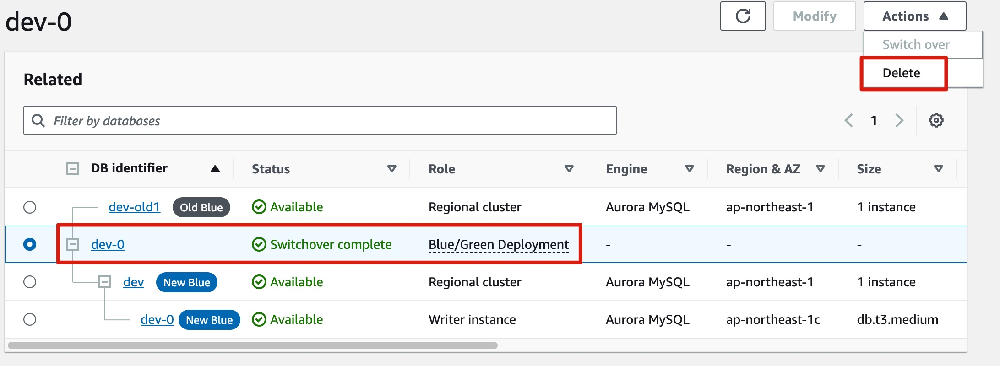

1. 建立 `aws_rds_cluster_parameter_group` `aws_db_parameter_group` 讓新的 MySQL 8.0 DB instance 使用

2. 更改 MySQL 5.7 的 `aws_rds_cluster_parameter_group` 的 `binlog_format` = `MIXED`。要重啟 DB instance 才會生效

2.1 如果不想影響服務，要增加一台 reader ，讓 reader 替代 writer。

3. 升級 原本的 DB instance spec (t3.micro > t3.medium)

4. 刪掉 RDS Proxy 或指到另一個 Database

5. 備份 MySQL 5.7

6. 建立 Blue Green Deployment

7. 使用這兩個 endpoint 測試服務試否正常
   MySQL 5.7 : dev-0.csmzgrqnkzxn.ap-northeast-1.rds.amazonaws.com
   MySQL 8.0 : dev-0-green-0n68ec.csmzgrqnkzxn.ap-northeast-1.rds.amazonaws.com

8. 正式切換

9. 刪除 MySQL 5.7

10. 刪除 Blue/Green Deployment

11. 刪除 MySQL 5.7 Cluster

11. RDS proxy 改回原本的 Database

12. 更改 `aws_rds_cluster` 設定
    `db_parameter_group_name` : `dev-db-parameter-group-8`
    `engine_version` : `8.0.mysql_aurora.3.05.1`

13. 更改 `aws_rds_cluster_instance` 設定
    `db_parameter_group_name` : `dev-db-parameter-group-8`
    `engine_version` : `8.0.mysql_aurora.3.05.1`
    `instance_class` : `db.t3.medium`
